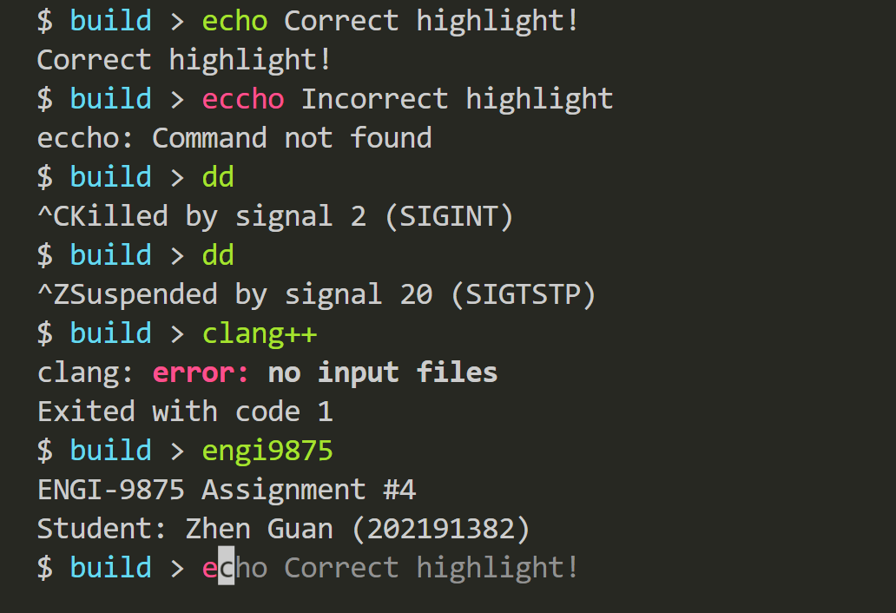
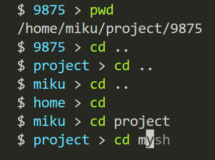

# Assignment #4

Student: Zhen Guan (202191382)

---



### Main Features

- Simple highlighting

Highlight builtin commands, cwd filenames and PATH executables as you type.

This is not a syntax highlighting, but a simple highlighting indicating if you have entered the correct builtin command, cwd filename or something in PATH.

- Autocomplete Suggestions

Matches start of the input with builtin commands, cwd filenames and history commands.

Hit `Tab` or `Right arrow` to accept the suggestion.

---

### Other Features

- History

By default 1,000 history commands are stored in memory. Switch between them with `Up` and `Down` arrow keys.

Show full history with `history` command.

- Cancellation

`Ctrl+C` to send SIGINT to the current foreground process. Won't kill the shell itself.

- Line editing

Use `Left` and `Right` arrow keys to move the cursor. `Backspace` and `Del` to delete characters.

- Suspension

`Ctrl+Z` to send SIGTSTP to the current foreground process. Won't suspend the shell itself.

- Tab completion

`Tab` or `Right` arrow key to complete the current input. If there are multiple matches, then it will not work. The completion is previewed as a suggestion in dimmed color.

- Some basic builtins like `cd`, `exit`. cwd is displayed in the prompt.



- Core functionality that required in the assignment
- Seems work well with anaconda

---

### Build and Run

```sh
mkdir build
cd build
cmake .. -B . && make -j8
./shsh
```

---

### Not Implemented

- Pipes
- Redirection
- Variables

All of them require complex input parsing and I was running out of time.
